# 💄 MIMO: 가상 메이크업 시뮬레이션 웹 서비스

> “앱에서도 립스틱 제품을 실제처럼 발라볼 수 없을까?”  
> 코로나 이후 급성장한 색조 화장품 시장,  
> AI를 활용한 실시간 시뮬레이션으로 온라인 메이크업 체험을 가능하게 한 프로젝트입니다.

> 국비 교육 과정 중 진행한 첫 번째 팀 프로젝트로, React와 CSS를 활용해 가상 메이크업 시뮬레이션 웹 애플리케이션을 개발했습니다.
> 처음 도전한 개발 작업에 막막함을 느꼈지만, 디자이너와의 협업을 통해 UI/UX 디자인을 구체화했습니다.
> HTML과 CSS로 초기 레이아웃을 구성한 후 React로 컴포넌트화하며 점차 자신감을 얻었습니다.
> 이 과정에서 Ajax로 API를 호출하고 OAuth2를 활용해 구글 로그인 기능을 구현하며 백엔드와의 통신 흐름도 익힐 수 있었습니다.
> 팀원들과 함께 기능 구현부터 문제 해결에 이르기까지 다양한 경험을 통해 프론트엔드와 백엔드 간의 협업과 기술 스택 활용법을 배울 수 있었습니다.
---

## 🧠 프로젝트 개요

- **진행 기간**: 2022.01 ~ 2022.03 (2개월)
- **기여도**: UX/UI 설계 및 프론트엔드 개발 100%  
- **기획 목적**:  
  코로나로 오프라인 테스트가 어려워진 상황에서  
  **사용자가 직접 얼굴에 색조를 적용해보며** 화장품을 선택할 수 있는 웹 시뮬레이션 서비스 개발

---

## 🎯 주요 기능

| 기능 | 설명 |
|------|------|
| 🎥 웹캠 기반 얼굴 촬영 | 사진 촬영 후 립스틱 색상 적용 |
| 🖼 AI 시뮬레이션 | 얼굴 영역 분리 후 립 컬러 매핑 |
| 🛒 장바구니 & 상품 정보 | 좋아요, 상세보기, 구매 버튼 |
| ✍️ 리뷰 작성 | 텍스트 및 이미지 리뷰 |
| 🔐 소셜 로그인 | OAuth 기반 로그인 |

---

## 🖼️ UI 미리보기

## 🖼️ UI 미리보기

  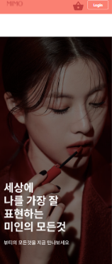
  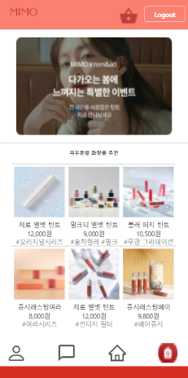 
  
  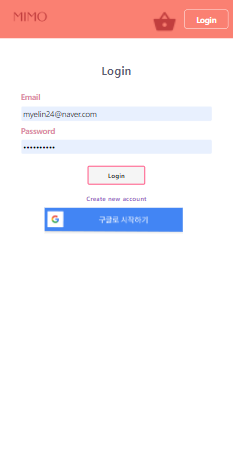 
  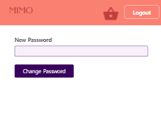
  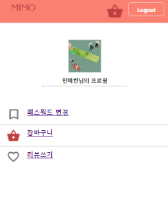 
  

---

##  🖼️ 미모 프로젝트 profile

  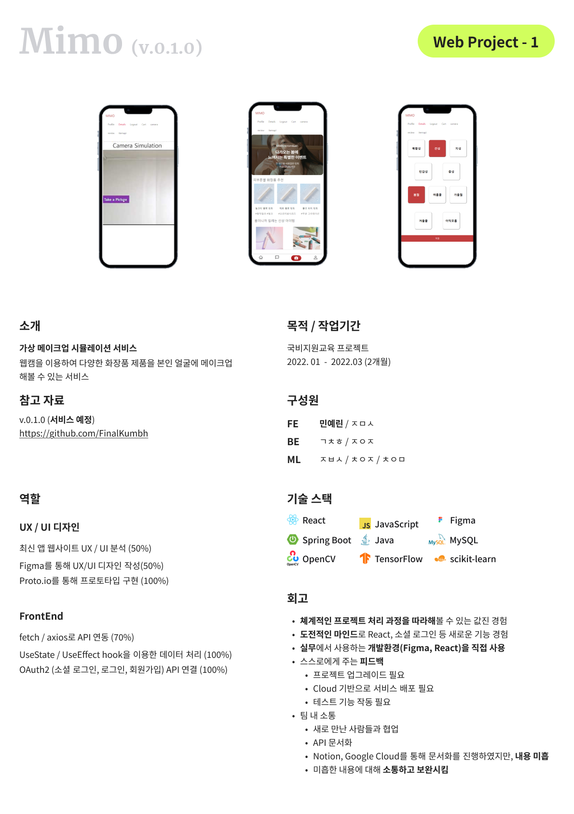
  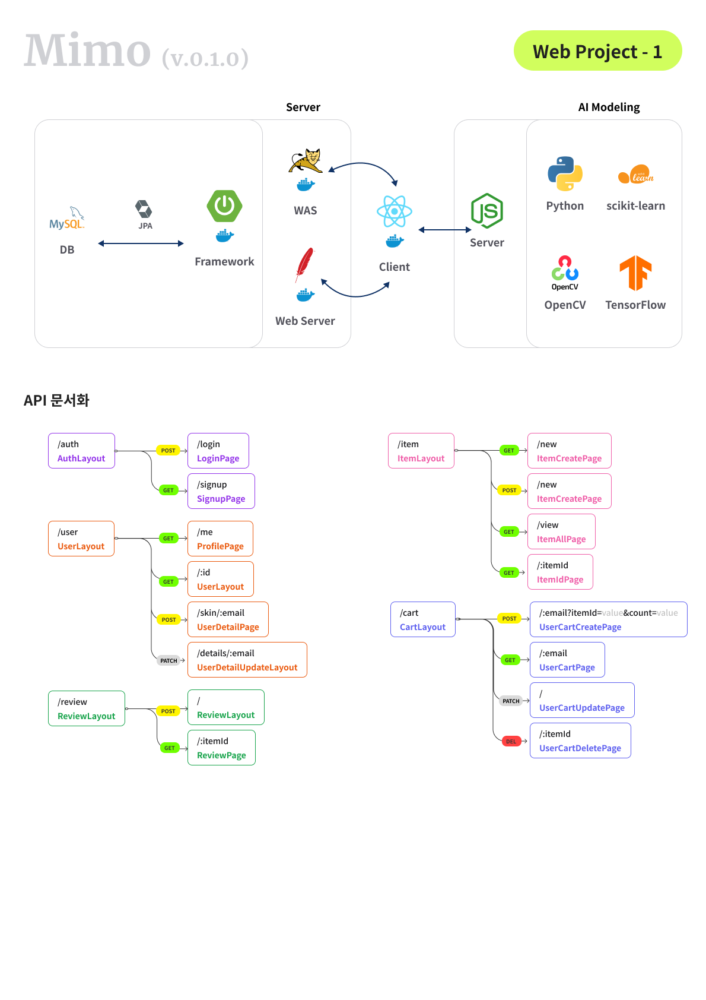

--
## 🧪 기술 스택

| 파트 | 사용 기술 |
|------|-----------|
| **Frontend** | React, JavaScript, HTML/CSS |
| **Backend** | Spring Boot, Java, MySQL |
| **AI** | Node.js, TensorFlow, OpenCV, scikit-learn |
| **UI/UX** | Figma, Proto.io |
| **Infra** | Google Cloud, Firebase |
| **협업 툴** | Notion, Zeplin |

---

## 🔍 AI 모델 구성

- **모델 타입**: U-Net 기반 Face Segmentation
- **Dataset**: CelebA
- **정확도**:
  | 모델 | Accuracy (%) | mIoU (%) |
  |------|---------------|----------|
  | U-Net | 91.15% | 88.00% |

- **적용 흐름**: 얼굴 촬영 → 이미지 전처리(OpenCV) → 얼굴 파츠 마스킹 → 색상 덧입히기

  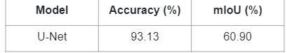
  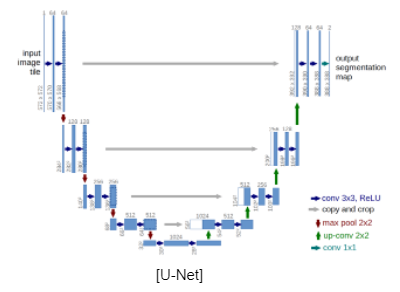
  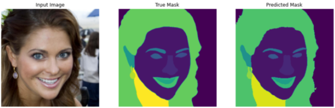

---

## 🧭 ERD & Flow Chart

  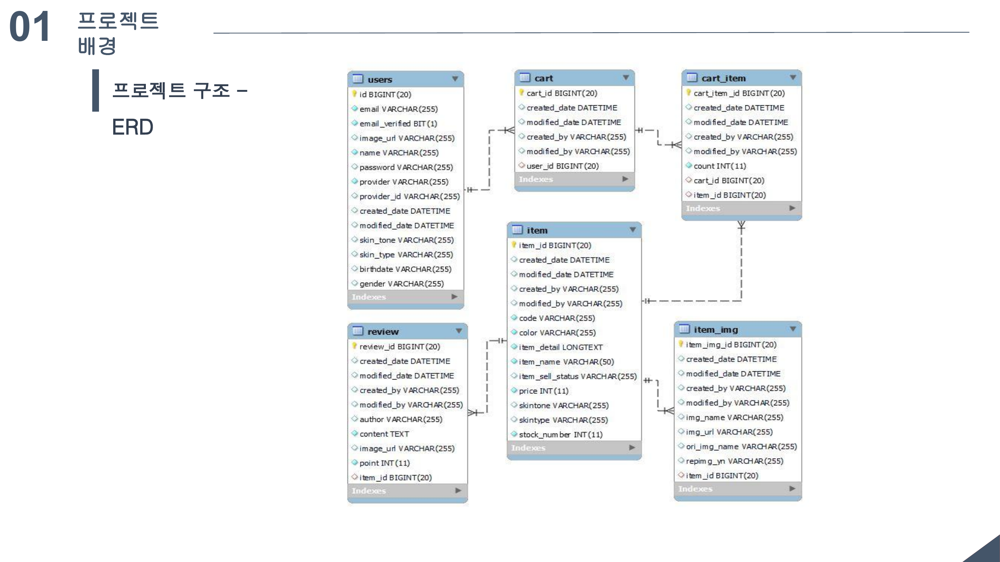
  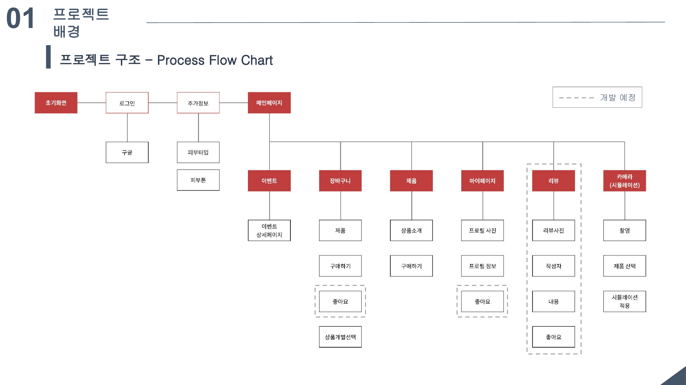

---

## 📝 프로젝트 회고

- 프론트/백엔드/AI 연동 전체 구조를 이해하고 직접 구현
- 사용자 중심의 UI 설계와 반복적인 피드백 기반 개선
- 실제 기획부터 팀 협업, 배포 경험까지 폭넓은 실무 감각 향상

---

