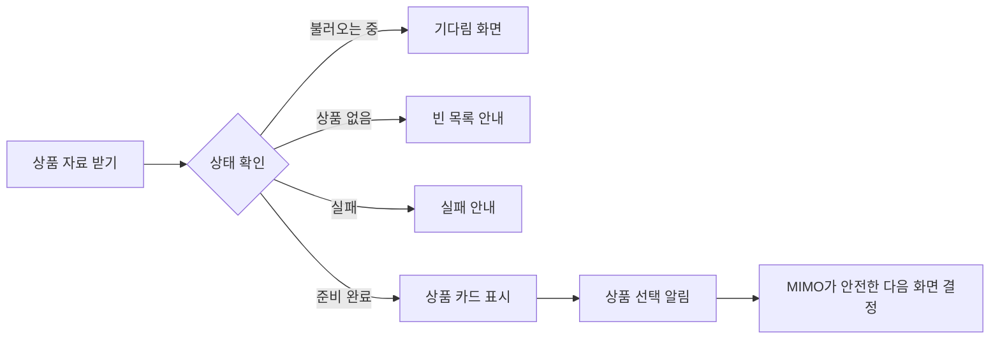

# MIMO 상품 카드 위젯 쉬운 가이드

> **핵심 한 줄:** 상품을 보여 주는 카드 모양은 함께 쓰고, 상품 자료를 읽거나 다른 화면으로 가는 규칙은 MIMO 안에 따로 둡니다.

**다음 행동 하나:** 아래 After 예상 화면을 보고 “이 모양으로 구현을 시작해도 되는지” 결정합니다.

## 목표·현재 위치·확인 방법

- 대상: MIMO `R06-W01` 상품 카드 목록
- 비교 대상: KMovement `R05-W02` 장소 카드·찜
- 현재 단계: 예상안 작성 완료, 구현·앱 실행·운영 API·배포 미착수
- 근거: 16개 저장소·52개 후보 보고서와 고정 커밋 정적 코드

### 3줄 줄거리

1. 지금 상품 목록은 화면 그리기와 자료 읽기가 한 덩어리입니다.
2. 새 예상안은 카드 모양과 MIMO 전용 연결을 나눕니다.
3. 이번 보고서는 예상 화면까지이며 실제 앱을 바꾸거나 실행한 결과는 아닙니다.

## 1. 핵심 기능

| 번호 | 기능 | 쉬운 뜻 |
|---|---|---|
| E1 | 상품 카드 | 그림·상품명·가격·설명을 보기 좋게 모읍니다. |
| E2 | 화면 상태 | 불러오는 중, 상품 없음, 실패, 준비 완료를 서로 다르게 보여 줍니다. |
| E3 | 상품 선택 | 카드 클릭이나 키보드 선택을 MIMO 연결 도우미에게 알려 줍니다. |
| E4 | 안전 경계 | 저장·주문·결제·찜 기능을 이 첫 화면에 섞지 않습니다. |

## 2. 진행 흐름

## 3. Before / After GUI

### Before

**코드 기반 재구성 · 설명용 상품 · 실제 캡처 아님**
현재 확인된 모양과 구조를 다시 그렸습니다. 화면이 상품 자료를 직접 읽고, 이동 주소가 연결되지 않을 수 있으며, 상품이 0개일 때 별도 안내가 없습니다.

### After

**개선 예상 화면 · 구현·실행 전 모형**
카드 모양, 빠진 이미지, 긴 글, 키보드 선택을 한 화면에서 확인하도록 만든 목표 모습입니다.

## 4. 무엇을 같이 쓰고 무엇을 나눌까

| 같이 쓰는 부분 | MIMO에 따로 둘 부분 | KMovement에 따로 둘 부분 |
|---|---|---|
| 그림·제목·설명·작은 정보표, 기다림·빈 화면·실패 화면, 카드 선택 | 가격, 상품 설명, 상품 자료 읽기, 안전한 상품 이동 | 주소, 추천 이유, 장소 상세, 찜 저장 |

## 5. 내가 할 일

- 지금 직접 할 일: **After 예상 화면 승인 여부만 결정**합니다.
- 도우미에게 부탁할 말: “MIMO 상품 카드 하나만 After 예상 화면대로 만들고, 저장·주문·결제는 넣지 마세요.”
- 끝났는지 확인하는 법: 상품 0개·1개·여러 개·불러오기 실패·이미지 누락 화면을 나란히 받고, 카드 클릭과 키보드 선택이 각각 한 번만 동작하는지 봅니다.

## 6. 완료 기준

- Before와 After의 상품명·가격·설명 수가 같은 시험 자료에서 일치합니다.
- 기다림·빈 목록·실패·준비 완료가 서로 다른 문구와 화면으로 보입니다.
- 그림이 없거나 제목이 길어도 카드가 겹치지 않습니다.
- 마우스와 키보드로 상품을 한 번 선택할 수 있습니다.
- 저장·주문·결제·찜은 실행되지 않습니다.

**현재 판정:** 예상안 완료. 구현과 실제 화면 검증은 아직입니다.
