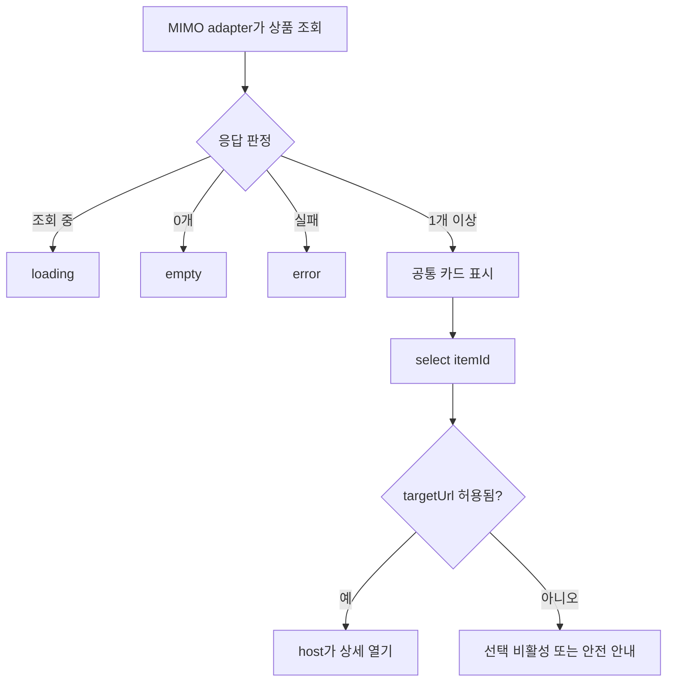

# MIMO 상품 카드 위젯 Fix Guide

> **핵심 한 줄:** `MainList`에 섞인 조회·표시·이동을 나누고, 공통 카드 UI에는 읽기나 저장 부수효과를 넣지 않습니다.

## 목표·현재 위치·가설 검증

- 대상: MIMO `R06-W01` 상품 카드 목록
- 비교 대상: KMovement `R05-W02` 장소 카드·찜
- 현재 단계: 예상안 작성 완료, 구현·앱 실행·운영 API·배포 미착수
- 근거: 16개 저장소·52개 후보 보고서와 고정 커밋 정적 코드

### 3줄 줄거리

1. 정적 코드에서 상품 조회와 카드 렌더링이 같은 컴포넌트에 있고, 카드가 쓰는 `item.Url`은 조회 결과 매핑에서 빠져 있습니다.
2. KMovement와는 카드 껍데기·상태·선택 이벤트만 공유하고 가격·주소·찜 저장은 분리해야 합니다.
3. Before는 코드 기반 재구성, After는 개선 예상 모형이며 둘 다 실제 실행 캡처가 아닙니다.

## 0. 식별과 상태

`[2026-09-20 / MIMO R06-W01 / update-readme@1ebd7114c480 / 정적 확인 / 구현·운영 검증 미실행]`

## 1. 현재 문제와 사용자 영향

| 문제 | 확인된 근거 | 사용자 영향 |
|---|---|---|
| 조회와 표시 결합 | `MainList` 내부 `fetchItems`가 Firebase를 직접 읽음 | 다른 공급자로 바꾸거나 독립 위젯으로 시험하기 어려움 |
| 이동 주소 누락 | `MainListItem`은 `item.Url`을 사용하지만 `loadedItems`에는 URL을 넣지 않음 | 카드를 눌러도 올바른 화면으로 가지 않을 수 있음 |
| 빈 목록 계약 없음 | 로딩·오류 분기는 있으나 `items.length === 0` 전용 상태 없음 | 정상적인 0건과 화면 이상을 구분하기 어려움 |
| 고정 폭 | `.MainList`가 500px 절대 배치 | 좁은 화면에서 배치 검증 필요 |

## 2. Before / After GUI

### Before — 현재 구조 재구성

**코드 기반 재구성 · 실제 캡처 아님.** 정적 JSX와 CSS의 확인된 구조만 표현했습니다.

### After — 수정 목표 예상 화면

**개선 예상 화면 · 미구현.** 반응형 카드, 이미지 대체, 명확한 선택 상태를 포함한 목표 화면입니다.

## 3. 공통화 경계

| 계층 | 공통 모듈 | MIMO adapter | KMovement adapter |
|---|---|---|---|
| 표시 | 이미지·제목·summary·meta·상태·선택 이벤트 | 가격·상품 설명·상품 URL | 주소·추천 이유·장소 상세 |
| 이벤트 | `open/select(itemId)` envelope | 허용된 상품 상세 이동 | `open(contentId)` |
| 보조 행동 | 선택적 action slot만 제공 | 첫 파일럿에서는 사용 안 함 | `toggleSave(contentId)` |
| 부수효과 | 공통 위젯 `none` | Firebase 읽기와 host 이동 | 장소 조회, 찜 저장, analytics |

## 4. 수정 위치와 방법

1. `mimo-frontend/src/components/Main/MainList.jsx`
   - `MainListItem`을 표시 전용 카드로 분리합니다.
   - `fetchItems`와 상태 관리를 host adapter로 옮깁니다.
   - `item.Url`을 추측하지 말고 응답의 실제 URL 필드를 확인해 `targetUrl`로 정규화합니다. 없으면 선택을 비활성화합니다.
2. `mimo-frontend/src/components/Main/Main.css`
   - 500px 절대 배치를 반응형 grid/list로 바꾸는 범위를 별도 구현안에 명시합니다.
3. SDUI 계약
   - `items[]`, `state`, `select(itemId)`를 선언하고 위젯은 `sideEffect: none`으로 둡니다.
   - Firebase endpoint와 인증정보를 props·manifest에 넣지 않습니다.

## 5. 실행 흐름

## 6. 그대로 전달할 구현 요청문

> A03 Personal Dev (@mina_personalWorkBot)에게: MIMO `R06-W01` 상품 카드 목록 하나만 대상으로, Before 재구성과 After 예상 화면을 기준으로 표시 UI와 Firebase 조회를 분리해 주세요. 공통 위젯은 `loading/empty/error/ready`, `items[]`, `select(itemId)`만 담당하고 부수효과는 `none`으로 유지하세요. `item.Url`은 실제 응답 필드를 확인해 `targetUrl`로 명시적으로 매핑하며 값이 없으면 임의 생성하지 마세요. 저장·주문·결제와 KMovement 찜 저장은 제외하세요. 정상·0개·1개·여러 개·실패·이미지 누락·긴 제목·키보드 선택 증거와 Before/After 실제 실행 캡처를 제출해 주세요. 코드 변경은 별도 구현 승인 후 시작하세요.

## 7. 완료 보고에서 받을 증거

- 계약 검사 출력과 정상/빈 결과/실패 fixture 결과
- 실제 구현 후 동일 fixture의 Before/After 실행 캡처
- 마우스 클릭과 Enter/Space가 이벤트를 정확히 한 번 발생시키는 테스트
- 위젯 번들에 Firebase endpoint·비밀값·직접 `fetch`가 없다는 검사
- MIMO 상품 값 동등성 표와 KMovement fixture의 공통 카드 렌더링 결과
- 저장·주문·결제·찜 네트워크 요청 0건

## 8. 실패하면

- 실제 URL 필드가 확인되지 않으면 이동을 비활성화하고 추측 구현을 중지합니다.
- 빈 목록과 오류가 같은 화면이면 상태 계약부터 고칩니다.
- KMovement 찜 저장이 공통 위젯으로 들어오면 action slot과 adapter 경계를 다시 분리합니다.
- 제품 코드·테스트·화면 실행 근거가 없으면 “구현 완료”로 올리지 않습니다.

**사용자가 지금 직접 할 일:** After 예상 화면 승인 여부 결정.
**현재 판정:** 수정 예상안만 완료, 코드 변경·테스트·배포 미착수.
