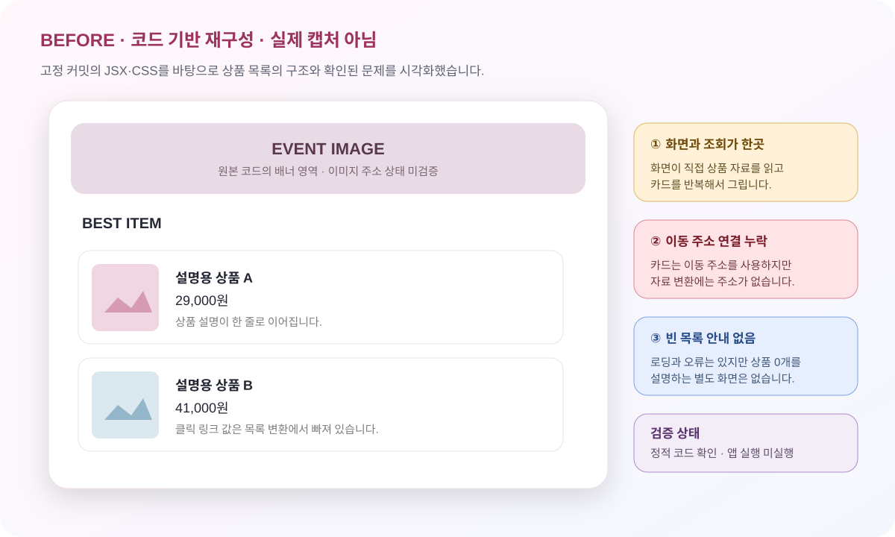
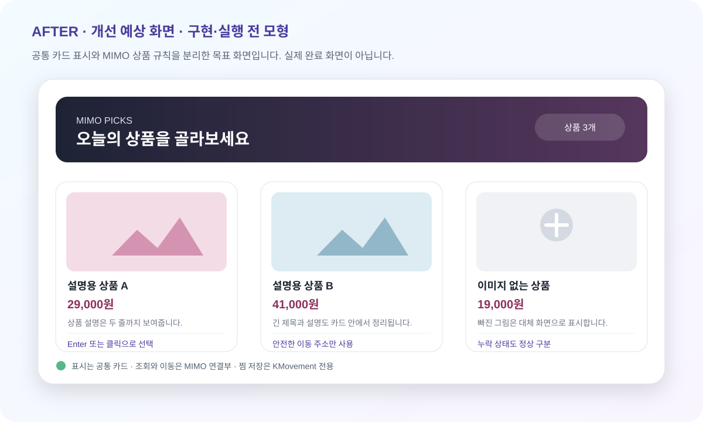
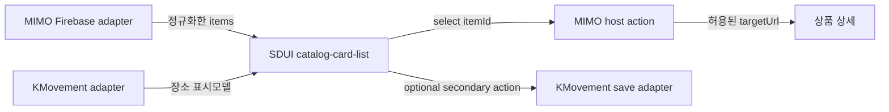

# MIMO R06-W01 화면·코드 인수인계

> **핵심 한 줄:** 상품 카드 화면은 `MainListItem`이 그리고, `MainList.fetchItems`가 Firebase 응답을 카드 값으로 바꾸지만 링크 URL은 변환하지 않습니다. 예상안은 이 연결을 표시 위젯과 MIMO adapter로 분리합니다.

## 1. 목표와 읽는 순서

- 대상: MIMO `R06-W01` 상품 카드 목록
- 비교 대상: KMovement `R05-W02` 장소 카드·찜
- 현재 단계: 예상안 작성 완료, 구현·앱 실행·운영 API·배포 미착수
- 근거: 16개 저장소·52개 후보 보고서와 고정 커밋 정적 코드


1. Before 재구성에서 현재 화면 구조를 봅니다.
2. S1~S5로 사용자 선택부터 API와 화면 결과까지 따라갑니다.
3. After 예상 화면과 공통/전용 경계를 확인합니다.
4. 완료 기준으로 구현 증거를 판정합니다.

## 2. GUI Before / After

### Before — 현재 코드에서 확인된 화면 구조



- 종류: **코드 기반 재구성 · 설명용 데이터 · 실제 앱 캡처 아님**
- 근거: `MainList.jsx`와 `Main.css`의 고정 커밋 정적 확인
- 확인된 요소: 배너 영역, BEST ITEM, 세로형 상품 카드, 이미지·제목·가격·설명
- 미확인: 현재 운영 Firebase 응답, 실제 이미지 로드, 브라우저 배치, 클릭 이동

### After — 제안하는 SDUI 화면



- 종류: **개선 예상 화면 · 미구현 · 실제 실행 캡처 아님**
- 목표: 반응형 카드, 이미지 누락 대체, 상태 분리, 키보드 선택
- 경계: 화면은 표시와 이벤트만 담당하고 조회·이동은 host adapter가 담당

## 3. 화면 → 코드 → API → 결과

| 단계 | 사용자·화면 | 담당 코드 | 받는 값 | 처리·분기 | 반환·부수효과 |
|---|---|---|---|---|---|
| S1 | 상품 목록에 진입 | `MainList` | 없음 | 마운트 후 상품 조회 시작 | 로딩 상태 표시, 네트워크 읽기 시작 |
| S2 | 상품 자료를 기다림 | `fetchItems` | Firebase 객체 | 응답 `key`를 `id`로 바꾸고 title·price·content·imgUrl 복사 | `items` 상태 갱신 |
| S3 | 성공·실패 확인 | `fetchItems` / `MainList` | HTTP 응답 | `response.ok`가 아니면 오류, 성공이면 JSON 순회 | loading 종료, 오류 또는 카드 목록 |
| S4 | 카드를 봄 | `MainListItem` | `item` | 이미지·제목·가격·설명을 렌더링 | 카드 JSX 반환 |
| S5 | 카드를 선택 | `<a href={item.Url}>` | `item.Url` | 브라우저 이동 시도 | 페이지 이동 부수효과; URL 매핑 누락으로 동작 미확인 |

## 4. 핵심 코드 근거

- MIMO 기준: `update-readme @ 1ebd7114c480a2917bff4c99e455a3150e2963da`
- [`MainListItem` · MainList.jsx L5](https://github.com/feed-mina/MIMO/blob/1ebd7114c480a2917bff4c99e455a3150e2963da/mimo-frontend/src/components/Main/MainList.jsx#L5)
- [`fetchItems` · MainList.jsx L30](https://github.com/feed-mina/MIMO/blob/1ebd7114c480a2917bff4c99e455a3150e2963da/mimo-frontend/src/components/Main/MainList.jsx#L30)
- 조회: `GET https://mimo-49f6d-default-rtdb.firebaseio.com/itmes.json`
- 읽는 필드: `title`, `price`, `content`, `imgUrl`; Firebase key를 `id`로 사용
- 연결 공백: 카드가 읽는 `item.Url`은 `loadedItems`에 넣지 않음
- CSS: `.MainList` 절대 배치·폭 500px, `.itemimage` 140×140px

## 5. KMovement와의 실제 비교

| 항목 | 공통 카드 계약 후보 | MIMO 전용 | KMovement 전용 |
|---|---|---|---|
| 입력 | `id`, `title`, `image`, `summary`, `meta[]` | `price`, `content`, `targetUrl` | `contentId`, `addr`, `recommendReason`, `isSaved` |
| 기본 이벤트 | `open/select(id)` | 상품 상세 이동 | 장소 상세 `onOpen` |
| 보조 이벤트 | optional action slot | 첫 파일럿 미사용 | `onToggleSave(contentId)` |
| 저장 | 없음 | 기존 상품 노드 읽기만 | 상위 `localStorage kride:saved-pois` |
| 화면 근거 | 이미지·제목·보조문구 카드 | 기존 단순 세로 카드 | `TourPoiCard`의 주소·추천 이유·찜 버튼 |
| 권리·보안 | 이미지 origin·alt·외부 링크 검사 | 상품 이미지와 고객별 공급자 | 여행 사진·외부 링크·사용자별 찜 동기화 |

KMovement 근거: `main @ 566fc5a629b5d8ed07c7e203bd68b87906b8a813`, `TourPoiCard.tsx`는 상세 버튼과 별도 찜 버튼을 제공하고, 찜 저장은 상위 화면에 남깁니다.

## 6. After 구조와 계약 예상안



```json
{
  "widgetId": "mimo.catalog-card-list",
  "version": "0.1.0",
  "sideEffect": "none",
  "props": {
    "state": "ready",
    "items": [{
      "id": "product-1",
      "title": "설명용 상품 A",
      "image": {"src": "https://allowed.example/a.jpg", "alt": "설명용 상품 A"},
      "summary": "상품 설명",
      "meta": [{"label": "가격", "value": "29,000원"}]
    }]
  },
  "events": {"select": {"itemId": "product-1"}}
}
```

설명용 계약이며 구현 완료 증거가 아닙니다. Firebase URL과 인증정보는 위젯 props나 manifest에 두지 않습니다.

## 7. 수정 영향과 유지보수 순서

| 바꾸는 위치 | 바뀌는 것 | 그대로인 것 | 함께 시험할 것 |
|---|---|---|---|
| `MainList.jsx` | 조회와 표시 분리, URL 명시 매핑, empty 상태 | 기존 상품 필드의 의미 | 정상·0/1/다수·HTTP 실패 |
| `Main.css` | 반응형 grid/list, 긴 글과 누락 이미지 | 브랜드 색·문구는 범위 확정 후 유지 | 좁은 화면·긴 제목·이미지 누락 |
| SDUI widget | 공통 카드와 상태·선택 이벤트 | Firebase 업무 규칙 없음 | schema·키보드·단일 이벤트 |
| MIMO adapter | Firebase 응답 정규화·허용 URL 검사 | 상품 자료원과 권한 | 잘못된 URL·누락 필드 |
| KMovement adapter | 공통 표시모델 사용 가능 | 주소·추천·찜 저장 | 상세/찜 버튼 독립 조작 |

## 8. 완료 판정

1. `items` 0개·1개·여러 개에서 각각 empty 또는 카드 수가 정확합니다.
2. loading·empty·error·ready가 서로 다른 DOM 상태와 문구를 가집니다.
3. 이미지 누락·긴 제목·긴 설명에서 가로 넘침이나 겹침이 없습니다.
4. 클릭·Enter·Space가 `select(itemId)`를 각각 정확히 한 번 발생시킵니다.
5. `targetUrl`이 없거나 허용되지 않으면 이동하지 않습니다.
6. 공통 위젯에는 직접 `fetch`, Firebase endpoint, 저장·주문·결제·찜 쓰기가 없습니다.
7. 같은 카드 골격으로 KMovement fixture가 렌더링되지만 찜 저장은 별도 adapter에 남습니다.
8. 구현 후 실제 앱의 Before/After 실행 캡처와 테스트 출력이 있어야 완료로 전환합니다.

## 9. 근거와 상태

- 직접 읽음: 16개 저장소·52개 후보 Markdown, handoff JSON, MIMO/KMovement 통합 보고서
- 고정 커밋 직접 확인: MIMO `MainList.jsx`, `Main.css`; KMovement `TourPoiCard.tsx`
- 이번 산출물: 분석·GUI 재구성·개선 예상안·완료 기준
- 미실행: 제품 코드 수정, 앱 실행, Firebase 호출, 테스트, 배포

**현재 판정:** 인수인계와 예상안 완료. 구현과 실제 화면 검증은 미착수.
