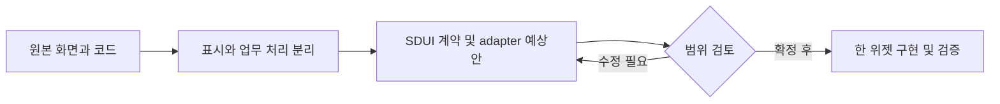

# MIMO — SDUI 위젯 후보

목표: 원래 화면의 역할과 코드를 확인하고, 한 위젯씩 분리할 대상을 정한다. 기준: `update-readme` / `1ebd7114c480a2917bff4c99e455a3150e2963da`.

상품·리뷰 UI가 있는 React 앱. 분석 원본은 default update-readme, SDUI 샘플 문서는 main에 별도 존재한다. main 샘플은 화면 예제이며 인증·주문 백엔드 완성 증거가 아니다.

공개 범위: 공개. 선언된 라이선스 미확인: 상용 재사용 전 본인·공동 기여자·이미지 권리 확인. 후보는 구현 완료나 재배포 허가를 의미하지 않는다.

9/18·19·20 KST 커밋 수: 0 / 4 / 0. 병합·문서 커밋 포함; 기능 수 아님. 일요일은 조사 시점까지만.

|ID|위젯 후보|현재 상태|분리 작업|
|---|---|---|---|
|R06-W01|상품 카드 목록|표시 소스 있음 / SDUI 화면 예제 있음 / 실제 위젯 미제작|데이터 fetch를 host 어댑터로 분리; item.Url이 매핑되지 않는 문제 정리; 빈 목록 계약|
|R06-W02|별점 선택기|표시·선택 소스 있음 / 독립 SDUI 계약 필요|키보드·접근성·값 범위 검증과 JSON props 계약 추가|
|R06-W03|리뷰 작성 폼|폼·요청 코드 있음 / 저장 계약 불일치|FormData와 application/json 헤더 불일치 수정; 중복 제출·실패 상태; 업로드 어댑터 분리|

브랜치 구분: 활동 집계는 update-readme + main의 SHA 중복 제거이며, 앱 소스 분석은 update-readme, SDUI 문서·예제는 main 기준이다.

## R06-W01 · 상품 카드 목록

이미지·가격·설명으로 상품을 고르는 목록을 위젯 후보로 분리한다.

|항목|내용|
|---|---|
|입력|Firebase 상품 객체: title,price,content,imgUrl|
|처리|MainList가 GET 결과의 key를 id로 변환, 로딩·오류 분기 후 MainListItem 반복|
|반환·화면|상품 카드 화면; 제안 이벤트 select(itemId)|
|API|Firebase REST GET /itmes.json|
|저장|Firebase Realtime Database 기존 상품 노드|
|부수효과|조회; 링크 클릭 이동|
|보안·분리 경계|URL·이미지 origin 제한, 외부 이미지 권리, 고객별 데이터 공급자 분리|
|공통화 계열|catalog-card|
|구현 후 통과 기준|설명용 items 0/1/다수, 로딩·실패·누락 이미지, 선택 이벤트 확인; 운영 API 미실행|

핵심 코드:
- [function MainListItem · mimo-frontend/src/components/Main/MainList.jsx:5](https://github.com/feed-mina/MIMO/blob/1ebd7114c480a2917bff4c99e455a3150e2963da/mimo-frontend/src/components/Main/MainList.jsx#L5)
- [const fetchItems · mimo-frontend/src/components/Main/MainList.jsx:30](https://github.com/feed-mina/MIMO/blob/1ebd7114c480a2917bff4c99e455a3150e2963da/mimo-frontend/src/components/Main/MainList.jsx#L30)

## R06-W02 · 별점 선택기

별점 표시와 마우스 선택을 작은 입력 위젯으로 분리한다.

|항목|내용|
|---|---|
|입력|name,value,onChange|
|처리|RatingInput 임시 hover 상태와 확정 value를 분리하고 onChange(name,nextValue) 호출|
|반환·화면|별 모양 UI; 값 변경 콜백|
|API|없음|
|저장|React 로컬 상태|
|부수효과|부모 콜백 호출|
|보안·분리 경계|개인정보 없는 입력 UI; 리뷰 저장 권한과 분리|
|공통화 계열|rating-input|
|구현 후 통과 기준|hover 후 취소·확정·외부 value 갱신, 키보드 검증 필요|

핵심 코드:
- [function RatingInput · mimo-frontend/src/components/Review/RatingInput.jsx:5](https://github.com/feed-mina/MIMO/blob/1ebd7114c480a2917bff4c99e455a3150e2963da/mimo-frontend/src/components/Review/RatingInput.jsx#L5)
- [function Rating · mimo-frontend/src/components/Review/Rating.jsx:22](https://github.com/feed-mina/MIMO/blob/1ebd7114c480a2917bff4c99e455a3150e2963da/mimo-frontend/src/components/Review/Rating.jsx#L22)

## R06-W03 · 리뷰 작성 폼

닉네임·별점·본문·이미지를 모으는 입력 화면을 분리한다.

|항목|내용|
|---|---|
|입력|nickname,rating,content,imgUrl|
|처리|ReviewForm.handleSubmit가 FormData 조립 후 createReviews 호출, 입력 초기화|
|반환·화면|입력 폼; createReviews는 명시적 반환 데이터 없음|
|API|POST /createdReviews.json|
|저장|Firebase 리뷰 노드 쓰기 시도|
|부수효과|외부 저장 요청|
|보안·분리 경계|닉네임·이미지 개인정보, 업로드 크기/형식 검사, 사용자별 쓰기 인증 필요|
|공통화 계열|content-editor|
|구현 후 통과 기준|실제 저장 미검증. 성공/실패 시 입력 보존, 중복 클릭, JSON·파일 처리 계약 테스트|

핵심 코드:
- [const handleSubmit · mimo-frontend/src/components/Review/ReviewForm.jsx:29](https://github.com/feed-mina/MIMO/blob/1ebd7114c480a2917bff4c99e455a3150e2963da/mimo-frontend/src/components/Review/ReviewForm.jsx#L29)
- [export default async function createReviews · mimo-frontend/src/data/api.jsx:13](https://github.com/feed-mina/MIMO/blob/1ebd7114c480a2917bff4c99e455a3150e2963da/mimo-frontend/src/data/api.jsx#L13)

## 예상 작업 순서

이번 조사: 정적 소스 확인. 앱 실행·운영 API·실제 고객 화면 동등성은 검증하지 않았다. 위 흐름은 향후 작업 계획이며 현재 앱 호출 흐름이 아니다.
