# 유지보수 및 인수인계 문서

> 대상 저장소: `feed-mina/MIMO`  
> 분석 브랜치: `copilot/screen-code-handover`  
> 독자: 프로젝트를 처음 맡는 개발자  
> 범위: 프런트엔드, 확인 가능한 외부 API/데이터 저장소, 유지보수 절차  
> 산출물 성격: 현재 저장소에서 확인된 내용만 정리했으며, 저장소 밖 백엔드·DB 스키마는 추측하지 않았습니다.

## 문서 안내

| 항목 | 내용 |
|---|---|
| 대상 | React 기반 가상 메이크업 웹앱을 처음 유지보수하는 개발자 |
| 활용 방법 | 먼저 전체 구조와 화면 흐름을 읽고, 이후 각 기능의 핵심 파일·API·데이터 노드를 따라가며 변경 위치를 찾습니다. |
| 읽는 순서 | 1) [전체 구조](#architecture) → 2) [화면과 컴포넌트](#screens) → 3) [API](#api) → 4) [DB 스키마와 ERD](#db) → 5) [유지보수 절차](#maintenance) |
| 확인 범위 | `mimo-frontend/src`의 실제 라우트와 컴포넌트, 저장소에 포함된 이미지/문서, 로컬 실행 결과 |
| 제외된 항목 | Spring Boot 서버 소스, MySQL 마이그레이션/모델, `localhost:8000` AI 서버 구현, 배포 인프라 정의 |

### 빠른 이동
- [전체 구조](#architecture)
- [화면과 컴포넌트](#screens)
  - [홈 `/`](#screen-home)
  - [인증 `/auth`](#screen-auth)
  - [메인 상품 목록 `/main`](#screen-main)
  - [카메라 시뮬레이션 `/camera`](#screen-camera)
  - [시뮬레이션 결과/추천 `/simulate`](#screen-simulate)
  - [프로필 `/profile`](#screen-profile)
  - [비밀번호 변경 `/changepassword`](#screen-password)
  - [리뷰 `/review`](#screen-review)
- [API](#api)
- [DB 스키마와 ERD](#db)
- [유지보수 절차](#maintenance)

## 전체 구조

MIMO의 현재 저장소는 **React 프런트엔드만 포함**합니다. 화면 이동, 인증 토큰 보관, Firebase 기반 읽기/쓰기, 그리고 로컬 AI 서버 호출은 프런트엔드 코드에서 직접 처리합니다. README에는 Spring Boot, MySQL, Node.js AI 서버가 언급되지만, 해당 구현 소스는 이 저장소에 없습니다.

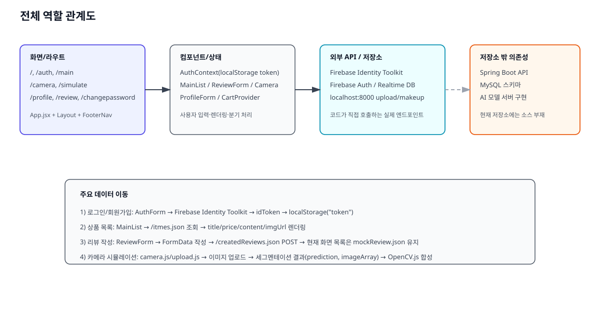

### 계층별 역할

| 계층 | 실제 위치 | 역할 |
|---|---|---|
| 프런트엔드 라우팅 | `/home/runner/work/MIMO/MIMO/mimo-frontend/src/App.jsx` | 인증 상태에 따라 접근 가능한 페이지를 나누고, 공통 레이아웃 안에서 페이지를 렌더링합니다. |
| 공통 레이아웃 | `components/Layout/*` | 상단 로고/로그인 버튼, 하단 아이콘 네비게이션을 제공하며 실제 주요 진입점은 `/main`, `/camera`, `/profile`, `/review`입니다. |
| 인증 상태 | `store/auth-context.jsx` | Firebase Identity Toolkit에서 받은 `idToken`을 `localStorage`의 `token` 키에 저장하고 로그인 여부를 계산합니다. |
| 데이터 조회/저장 | `components/Main/*`, `components/Review/*`, `components/Cart/*`, `data/api.jsx` | Firebase Realtime Database의 JSON 노드에 직접 요청합니다. |
| AI 시뮬레이션 | `components/Modeling/camera.js`, `components/Modeling/upload.js` | 촬영/업로드한 이미지를 `localhost:8000/api/v1/upload`, `localhost:8000/api/v1/makeup`으로 보내고, 응답을 OpenCV.js로 합성합니다. |
| 저장소 밖 시스템 | README에만 언급 | Spring Boot, MySQL, AI 모델 서버는 현재 저장소만으로는 검증할 수 없습니다. |

### 실제 데이터 이동

1. **로그인/회원가입**: `AuthForm`이 Firebase Identity Toolkit REST API를 호출하고, 응답의 `idToken`을 `AuthContext.login()`에 넘깁니다.  
2. **상품 목록**: `MainList`가 `/itmes.json`을 읽어 추천 상품 카드 목록을 렌더링합니다.  
3. **리뷰 작성**: `ReviewForm`이 `FormData`를 만들어 `/createdReviews.json`에 POST하지만, 같은 화면의 리뷰 목록은 `mockReview.json`을 읽기 때문에 자동 반영되지 않습니다.  
4. **카메라 기능**: `camera.js`와 `upload.js`가 업로드 API의 `path`, 메이크업 API의 `prediction`, `imageArray`를 받아 클라이언트에서 색을 입힙니다.

### 저장소에서 확인한 구조적 주의점

- `FooterNav`와 `MainNavigation`에는 `/cart` 링크가 있지만 `App.jsx`에는 `/cart` 라우트가 없습니다. 현재 클릭 시 와일드카드 경로 처리로 `/main`으로 돌아갑니다.
- `data/APIUtils.js`는 `../constants`를 import하지만 해당 파일이 없고, 현재 앱 런타임에서는 이 모듈이 연결되지 않습니다.
- `camera.js`는 함수형 컴포넌트 안에 `this.setState`를 사용해 현재 코드 그대로는 정상 동작 보장이 어렵습니다.
- `mimo-modeling` 폴더에는 분석 가능한 소스가 없습니다.

## 화면과 컴포넌트

## 화면 1. 홈 `/`

홈 화면은 서비스 소개 이미지와 가입 안내 문구만 보여주는 랜딩 페이지입니다. `props.authenticated`가 참이면 `useEffect`에서 `/main`으로 이동하도록 작성되어 있지만, 현재 `App.jsx`에서 해당 props는 전달하지 않습니다.

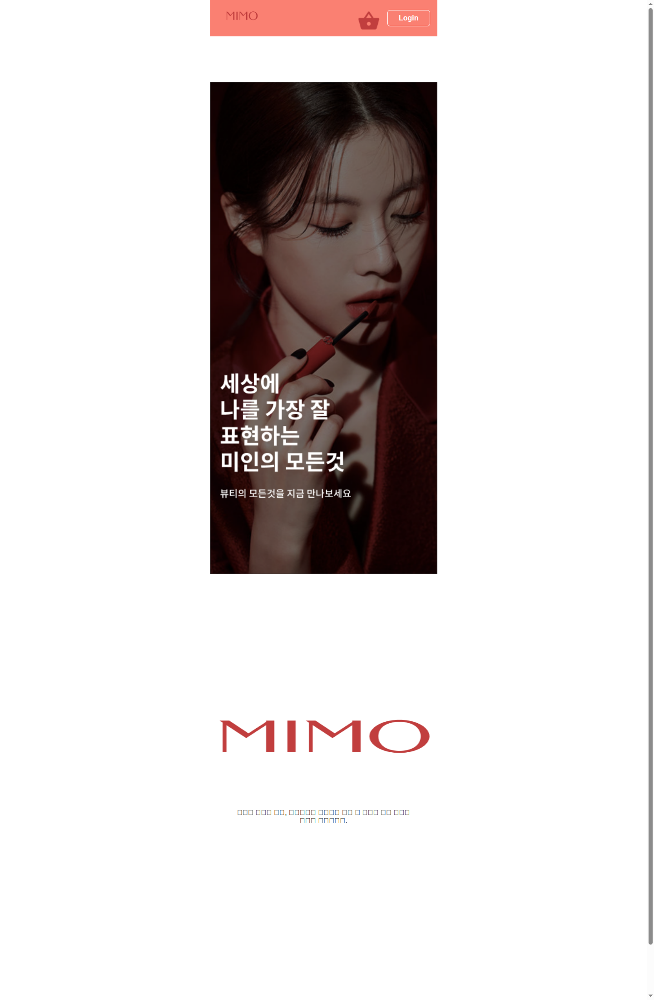

### 핵심 파일과 기능

| 파일 | 책임 | 기능에서 하는 일 |
|---|---|---|
| `components/Home/Home.jsx` | 랜딩 페이지 렌더링 | 서비스 인트로 이미지, 로고, 약관 안내 문구를 출력합니다. |
| `App.jsx` | 루트 라우팅 | `/` 경로에서 `Home`을 렌더링합니다. |
| `components/Layout/Layout.jsx` | 공통 외곽 | 홈 화면도 동일한 상·하단 네비게이션 레이아웃 안에 배치합니다. |

### 함수·컴포넌트 계약

| 대상 | 입력 | 처리 | 반환/부수 효과 |
|---|---|---|---|
| `Home(props)` | `props.authenticated`(불리언, 선택적) | 최초 렌더링 시 인증됨으로 판단하면 `navigate('/main')`을 시도합니다. | JSX를 반환하고, 조건이 맞으면 라우트 이동 부수 효과를 냅니다. |

### 화면 연결

- **입력 위치**: 직접 입력 요소는 없습니다.  
- **사용자 행동**: 상단 로고, 하단 네비게이션을 통해 다른 화면으로 이동합니다.  
- **결과 표시 영역**: 중앙 인트로 이미지와 로고, 하단 약관 안내 텍스트입니다.

### 사용 API / DB

이 화면은 API를 직접 호출하지 않습니다.

---

## 화면 2. 인증 `/auth`

인증 화면은 이메일/비밀번호 로그인과 회원가입을 같은 폼에서 전환하며, 별도로 Google 팝업 로그인 버튼을 제공합니다. 로그인 성공 시 `idToken`을 저장하고 `/main`으로 이동합니다.

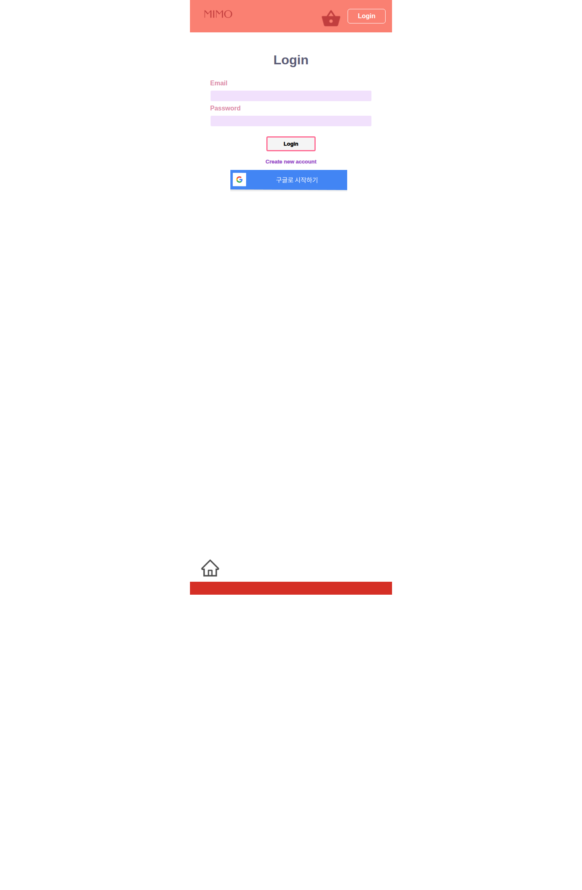

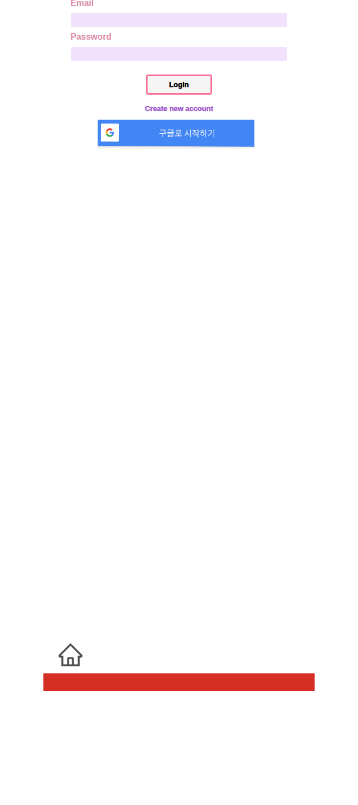

### 핵심 파일과 기능

| 파일 | 책임 | 기능에서 하는 일 |
|---|---|---|
| `pages/AuthPage.jsx` | 페이지 래퍼 | 인증 라우트에서 `AuthForm`만 렌더링합니다. |
| `components/Auth/AuthForm.jsx` | 인증 입력과 분기 처리 | 로그인/회원가입 URL 분기, Firebase REST 요청, Google 팝업 로그인을 수행합니다. |
| `store/auth-context.jsx` | 인증 상태 저장 | 토큰을 `localStorage`에 저장하고 `isLoggedIn`을 계산합니다. |
| `fbase.js` | Firebase 앱 초기화 | Firebase Auth 인스턴스를 만들고 Google 팝업 로그인에 사용합니다. |

### 함수·컴포넌트 계약

| 대상 | 입력 | 처리 | 반환값 / 부수 효과 |
|---|---|---|---|
| `switchAuthModeHandler()` | 없음 | `isLogin` 상태를 반전합니다. | 버튼 문구와 제출 URL이 바뀝니다. |
| `submitHandler(event)` | 폼의 `email`, `password` | `isLogin`이 참이면 `accounts:signInWithPassword`, 거짓이면 `accounts:signUp`을 호출합니다. | 성공 시 `authCtx.login(data.idToken)`, `navigate('/main')`; 실패 시 alert를 띄웁니다. |
| `onSocialClick()` | 없음 | `GoogleAuthProvider`로 팝업 로그인을 시도합니다. | 성공 시 `data.user`를 내부 state에 저장하지만 현재 후속 화면 이동은 없습니다. |
| `AuthContext.login(token)` | `token` 문자열 | state와 `localStorage['token']`을 함께 갱신합니다. | 이후 보호 라우트 접근 가능 상태가 됩니다. |

### 동작 흐름도

1. 사용자가 이메일과 비밀번호를 입력합니다.  
2. **조건 분기**: `isLogin`이 `true`면 로그인 API, `false`면 회원가입 API를 호출합니다.  
3. 응답이 성공이면 JSON을 읽고 `idToken`을 저장한 뒤 `/main`으로 이동합니다.  
4. 응답이 실패면 `Authentication failed!` 예외를 만들어 alert로 노출합니다.  
5. Google 버튼은 별도 병렬 경로이며, Firebase JS SDK의 팝업 인증을 사용합니다.

### 역할 관계

- 화면 요소 **Email/Password 입력칸** → `emailInputRef`, `passwordInputRef`  
- **로그인/가입 버튼** → `submitHandler()` → Firebase Identity Toolkit  
- **Google 버튼** → `signInWithPopup(authService, provider)`  
- **성공 결과** → `auth-context.jsx`의 `token`, `isLoggedIn` 변경 → 보호 라우트 열림

### 사용 API

| 메서드 | 경로 | 요청 필드 | 코드가 실제 사용하는 응답 필드 | 사용 위치 |
|---|---|---|---|---|
| POST | `https://identitytoolkit.googleapis.com/v1/accounts:signInWithPassword?key=...` | `email`, `password`, `returnSecureToken` | `idToken` | 로그인 제출 |
| POST | `https://identitytoolkit.googleapis.com/v1/accounts:signUp?key=...` | `email`, `password`, `returnSecureToken` | `idToken` | 회원가입 제출 |
| SDK popup | Firebase Auth Google provider | 없음 | `data.user` | Google 소셜 로그인 |

### 읽거나 쓰는 데이터

| 저장소 | 키/필드 | 읽기/쓰기 | 설명 |
|---|---|---|---|
| `localStorage` | `token` | 쓰기/읽기/삭제 | 인증 토큰 영속화 |
| Firebase Auth `currentUser` | `displayName`, `photoURL` 등 | 읽기 | 프로필 화면에서 다시 사용 |

---

## 화면 3. 메인 상품 목록 `/main`

메인 화면은 이벤트 배너와 추천 상품 목록을 렌더링합니다. 데이터는 Firebase Realtime Database의 `/itmes.json`에서 가져오며, 로딩/오류/정상 상태가 분기됩니다.

### 핵심 파일과 기능

| 파일 | 책임 | 기능에서 하는 일 |
|---|---|---|
| `pages/Mainpages.jsx` | 페이지 래퍼 | 실질적인 데이터 처리는 하지 않고 `MainList`를 렌더링합니다. |
| `components/Main/MainList.jsx` | 상품 목록 로딩과 렌더링 | `/itmes.json` 호출, JSON을 배열로 변환, 상품 카드 UI를 만듭니다. |
| `components/Layout/nav/FooterNav.jsx` | 주요 진입점 제공 | 하단 홈/카메라/리뷰/프로필 아이콘으로 이동합니다. |

### 함수·컴포넌트 계약

| 대상 | 입력 | 처리 | 반환값 / 부수 효과 |
|---|---|---|---|
| `MainList()` | props는 실질적으로 미사용 | 마운트 시 `fetchItems()`를 실행합니다. | JSX를 반환하고 내부 state(`items`, `isLoading`, `httpError`)를 갱신합니다. |
| `fetchItems()` | 없음 | `/itmes.json` 응답을 순회해 `{id,title,price,content,imgUrl}` 배열로 변환합니다. | 성공 시 목록을 그리며, 실패 시 오류 문구를 화면에 표시합니다. |
| `MainListItem({ item })` | `item.Url`, `item.imgUrl`, `item.title`, `item.price`, `item.content` | 카드 단위 표시를 만듭니다. | `<a>` 링크와 상품 요약 영역을 반환합니다. |

### 동작 흐름도

1. 화면 진입 시 `isLoading=true`로 시작합니다.  
2. Firebase 요청을 보냅니다.  
3. **실패 분기**: `response.ok`가 거짓이면 오류를 던지고 `httpError`를 렌더링합니다.  
4. **성공 분기**: 각 노드를 상품 카드용 구조로 변환해 `items`에 저장합니다.  
5. 로딩이 끝나면 이벤트 배너와 상품 리스트를 출력합니다.

### 화면 연결

- **상품 이미지/제목/가격/설명** → `responseData[key].imgUrl/title/price/content`  
- **상품 카드 링크** → `item.Url`을 사용하지만 현재 데이터 적재 시 `Url` 필드는 매핑하지 않아 실제 링크가 비어 있을 가능성이 큽니다.  
- **오류 영역** → 예외 메시지 문자열을 그대로 렌더링합니다.

### 사용 API / DB

| 메서드 | 경로 | 요청 | 응답에서 화면이 쓰는 필드 | 사용 위치 |
|---|---|---|---|---|
| GET | `https://mimo-49f6d-default-rtdb.firebaseio.com/itmes.json` | 없음 | `{[id]: {title, price, content, imgUrl}}` | 추천 상품 목록 |

### 읽는 데이터 노드

| 노드 | 필드 | 설명 |
|---|---|---|
| `/itmes/{itemId}` | `title`, `price`, `content`, `imgUrl` | 메인 화면 카드 구성에 사용합니다. |

---

## 화면 4. 카메라 시뮬레이션 `/camera`

카메라 화면은 웹캠을 열고 현재 프레임을 캔버스에 그린 뒤, 업로드/메이크업 API를 순차 호출해 립 또는 헤어 색상을 입히려는 목적의 화면입니다. 현재 저장소 코드 기준으로는 가장 복잡하지만 구현 미완성 흔적도 가장 많습니다.

### 핵심 파일과 기능

| 파일 | 책임 | 기능에서 하는 일 |
|---|---|---|
| `components/Modeling/camera.js` | 웹캠 촬영형 시뮬레이터 | 브라우저 카메라 접근, 캔버스 캡처, 업로드/메이크업 API 호출, 색상/부위 선택 UI를 담당합니다. |
| `components/Modeling/upload.js` | 파일 업로드형 시뮬레이터 | 이미지 파일 선택, 미리보기, 업로드 후 OpenCV.js 합성 흐름을 class component로 구현합니다. |
| `components/Modeling/constants.jsx` | 링크 상수 | `CAMERAIMAGE`, `PROD` 등 시뮬레이션 관련 링크 값을 제공합니다. |

### 함수·컴포넌트 계약

| 대상 | 입력 | 처리 | 반환값 / 부수 효과 |
|---|---|---|---|
| `getVideo()` | 없음 | `navigator.mediaDevices.getUserMedia({video:{width:1080,height:1080}})`를 호출합니다. | 성공 시 `<video>`에 stream을 연결하고, 실패 시 콘솔에만 에러를 남깁니다. |
| `takePhoto()` | 현재 비디오 프레임 | 캔버스에 프레임을 그려 data URL을 만들고 `FormData`에 `file`을 추가해 업로드 API를 호출합니다. | `hasPhoto=true`, 업로드 요청, 이후 메이크업 요청 부수 효과가 발생합니다. |
| `ColorChange(event)` | `event.target.value` (`#RRGGBB`) | 선택 색을 state에 저장합니다. | 이후 Apply 단계에서 사용됩니다. |
| `featureChange(event)` | `lip` 또는 `hair` | 선택 부위를 state에 저장합니다. | 이후 Apply 단계 조건 분기에 사용됩니다. |
| `Upload.onClickHandler()` | 선택한 파일 | 업로드 API → 메이크업 API를 순차 호출합니다. | `path`, `prediction`, `image`를 class state에 넣습니다. |
| `Options.onApplyHandler()` | `prediction`, `image`, `feature`, `color` | 부위 id에 따라 마스크를 만들고 OpenCV.js로 원본 이미지와 합성합니다. | `canvasOutput`에 결과를 렌더링합니다. |

### 실제 조건 분기를 담은 흐름도

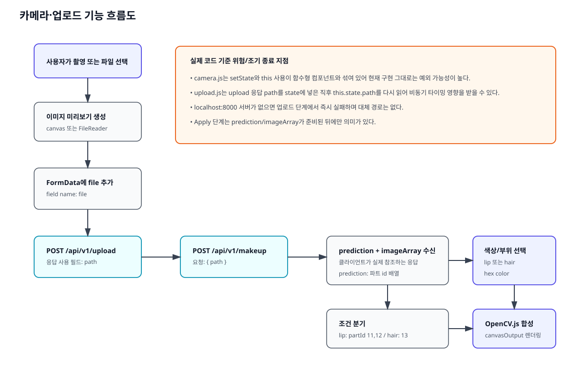

### 화면 요소와 코드 연결

| 화면 요소 | 연결된 상태/함수 | 입력 | 결과 |
|---|---|---|---|
| `Take a Picture` 버튼 | `takePhoto()` | 현재 비디오 프레임 | 캔버스 이미지 생성, 업로드 시도 |
| `Select feature` 드롭다운 | `featureChange()` / `Options.handleFeatureChange()` | `lip`, `hair` | Apply 때 칠할 파트 id 조건이 달라집니다. |
| 색상 선택 input | `ColorChange()` / `Options.handleColorChange()` | hex 색상 문자열 | RGB로 변환되어 합성 색으로 사용됩니다. |
| `Apply` 버튼 | `Options.onApplyHandler()` | 선택한 부위와 색, 예측 배열 | `canvasOutput`에 합성 이미지를 그립니다. |

### 사용 API

| 메서드 | 경로 | 요청 필드 | 코드가 실제 쓰는 응답 필드 | 사용 위치 |
|---|---|---|---|---|
| POST | `http://localhost:8000/api/v1/upload` | `FormData(file)` | `path` | 촬영/업로드 직후 |
| POST | `http://localhost:8000/api/v1/makeup` | `{ path }` | `prediction`, `imageArray` | 업로드 성공 후 |

### 읽거나 쓰는 데이터

이 화면은 브라우저 state와 캔버스만 직접 갱신하며, Firebase DB에는 쓰지 않습니다.

### 유지보수 메모

- `camera.js`는 `setFile(file)` 직후 `image_file` state를 바로 읽어 `FormData`에 넣기 때문에 타이밍 이슈가 있습니다.  
- 같은 파일에서 `this.setState(...)`를 사용하고 있어 함수형 컴포넌트 문맥과 맞지 않습니다.  
- `upload.js`의 OpenCV 합성 로직은 실제 기능 설명 근거로 유효하지만, `localhost:8000` 구현이 없어 서버 계약의 전체 스펙은 확인할 수 없습니다.

---

## 화면 5. 시뮬레이션 결과/추천 `/simulate`

`/simulate`는 로그인 사용자 정보를 콘솔에 출력하고, 촬영 이미지 자리와 추천 상품 이미지 링크를 배치한 정적 성격의 화면입니다. 현재 구현에서는 실제 시뮬레이션 결과를 계산하기보다 다음 행동을 안내하는 구성에 가깝습니다.

### 핵심 파일과 기능

| 파일 | 책임 | 기능에서 하는 일 |
|---|---|---|
| `components/Modeling/Simulate.jsx` | 추천/후속 행동 화면 | Firebase `currentUser`의 provider 정보를 콘솔에 출력하고 이미지/상품 링크를 보여줍니다. |
| `components/Modeling/constants.jsx` | 링크 정의 | `CAMERAIMAGE`, `PROD` 상수를 `/cameraimage`, `/prod:id` 같은 링크로 제공합니다. |

### 함수·컴포넌트 계약

| 대상 | 입력 | 처리 | 반환값 / 부수 효과 |
|---|---|---|---|
| `Simulate()` | Firebase `user` | `user !== null`일 때 프로필 관련 값과 providerData를 읽어 콘솔 로그를 남깁니다. | 추천 상품 이미지와 텍스트가 포함된 JSX를 반환합니다. |

### 사용 API / DB

직접 네트워크 요청은 없고, Firebase Auth의 현재 로그인 사용자 객체만 읽습니다.

---

## 화면 6. 프로필 `/profile`

프로필 화면은 로그인한 사용자의 프로필 사진과 이름, 그리고 비밀번호 변경/장바구니/리뷰 진입 링크를 제공합니다. 표시 데이터는 Firebase Auth의 `currentUser`에서 읽습니다.

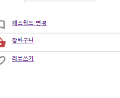

### 핵심 파일과 기능

| 파일 | 책임 | 기능에서 하는 일 |
|---|---|---|
| `components/Profile/UserProfile.jsx` | 프로필 헤더 렌더링 | `photoURL`, `displayName`을 읽어 프로필 영역을 출력합니다. |
| `components/Profile/ProfileContent.jsx` | 하위 메뉴 | `/cart`, `/review` 링크를 배치합니다. |
| `App.jsx` | 접근 제어 | 로그인 상태일 때만 `/profile` 라우트를 노출합니다. |

### 함수·컴포넌트 계약

| 대상 | 입력 | 처리 | 반환값 / 부수 효과 |
|---|---|---|---|
| `UserProfile()` | `authCtx.isLoggedIn`, `authService.currentUser` | 로그인 상태면 프로필 이미지와 이름을 출력합니다. | JSX를 반환합니다. |
| `ProfileContent()` | 없음 | 장바구니/리뷰 링크 블록을 표시합니다. | 실제 라우트 존재 여부와 무관하게 링크를 렌더링합니다. |

### 화면 연결

- **프로필 사진 영역** → `authService.currentUser.photoURL`  
- **이름 제목** → `authService.currentUser.displayName`  
- **패스워드 변경 메뉴** → `/changepassword`  
- **리뷰쓰기 메뉴** → `/review`  
- **장바구니 메뉴** → `/cart` (현재 App 라우트 미연결)

### 사용 API / DB

네트워크 호출은 없고 Firebase Auth 메모리 상태만 읽습니다.

---

## 화면 7. 비밀번호 변경 `/changepassword`

비밀번호 변경 화면은 새 비밀번호 한 개만 입력받아 Firebase Identity Toolkit의 계정 업데이트 API를 호출합니다. 성공/실패 분기 메시지 없이, 요청 완료 후 홈으로 이동하는 단순 흐름입니다.

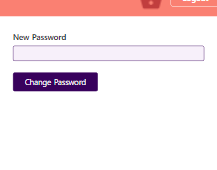

### 핵심 파일과 기능

| 파일 | 책임 | 기능에서 하는 일 |
|---|---|---|
| `components/Profile/ProfileForm.jsx` | 비밀번호 변경 폼 | 새 비밀번호를 읽어 계정 업데이트 REST API를 호출합니다. |
| `store/auth-context.jsx` | 토큰 공급 | 현재 토큰을 요청 본문 `idToken`으로 전달합니다. |

### 함수·컴포넌트 계약

| 대상 | 입력 | 처리 | 반환값 / 부수 효과 |
|---|---|---|---|
| `submitHandler(event)` | `new-password` 입력값, `authCtx.token` | `accounts:update` API에 `idToken`, `password`, `returnSecureToken:false`를 전송합니다. | 응답 본문 확인 없이 `navigate('/', {replace:true})`를 호출합니다. |

### 사용 API

| 메서드 | 경로 | 요청 필드 | 코드가 실제 쓰는 응답 필드 | 사용 위치 |
|---|---|---|---|---|
| POST | `https://identitytoolkit.googleapis.com/v1/accounts:update?key=...` | `idToken`, `password`, `returnSecureToken:false` | 없음 | 비밀번호 변경 제출 |

---

## 화면 8. 리뷰 `/review`

리뷰 화면은 이미지 첨부, 닉네임, 별점, 본문을 입력받는 작성 폼과 리뷰 목록을 함께 보여줍니다. 하지만 목록은 Firebase에서 다시 읽지 않고 `mockReview.json`을 사용하므로, 저장 성공과 목록 갱신이 연결되어 있지 않습니다.

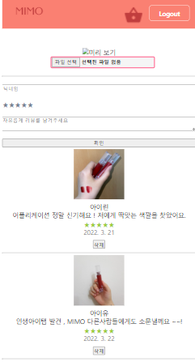

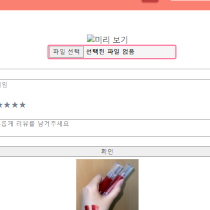

### 핵심 파일과 기능

| 파일 | 책임 | 기능에서 하는 일 |
|---|---|---|
| `components/Review/Review.jsx` | 리뷰 화면 조립 | `ReviewForm`과 `ReviewList`를 배치하고 삭제 핸들러를 가집니다. |
| `components/Review/ReviewForm.jsx` | 작성 폼 | 파일, 닉네임, 별점, 리뷰 본문을 state에 모아 `FormData`를 전송합니다. |
| `components/Review/FileInput.jsx` | 이미지 선택과 미리보기 | 파일 객체를 부모로 올리고 `URL.createObjectURL()`로 미리보기를 만듭니다. |
| `components/Review/RatingInput.jsx` / `Rating.jsx` | 별점 입력 | hover/select 상태를 별 문자 UI로 보여줍니다. |
| `components/Review/ReviewList.jsx` | 목록 표시 | `mockReview.json` 배열을 순회해 항목을 렌더링합니다. |
| `data/api.jsx` | 리뷰 API helper | `/createdReviews.json` POST와 `/review.json` GET helper를 제공합니다. |

### 함수·컴포넌트 계약

| 대상 | 입력 | 처리 | 반환값 / 부수 효과 |
|---|---|---|---|
| `handleChange(name, value)` | 필드명, 값 | 폼 state의 해당 키만 갱신합니다. | `values` state가 변경됩니다. |
| `handleSubmit(e)` | `values.content`, `values.imgUrl`, `values.nickname`, `values.rating` | `FormData`를 만들고 `createReviews(formData)`를 호출합니다. | 성공 후 입력값을 초기화합니다. |
| `FileInput.handleChange(e)` | 선택한 파일 | 첫 번째 파일을 부모 `onChange`로 전달합니다. | 미리보기 URL 생성의 입력이 됩니다. |
| `RatingInput` | 현재 점수 | hover와 click 이벤트를 별점 값으로 변환합니다. | 부모의 `rating`을 갱신합니다. |
| `handleDelete(id)` | 삭제할 review id | mock 배열에서 해당 항목을 제외합니다. | 화면 목록만 바뀌고 서버 삭제는 하지 않습니다. |

### 실제 분기 흐름

1. 사용자가 이미지, 닉네임, 별점, 내용을 입력합니다.  
2. 파일 선택 시 `FileInput`이 브라우저 로컬 미리보기를 만듭니다.  
3. 제출 시 `FormData`를 만들어 `/createdReviews.json`으로 보냅니다.  
4. 성공 후 폼 state는 초기화됩니다.  
5. **별도 분기**: 화면 하단 목록은 네트워크 응답과 무관하게 `mockReview.json`만 보여줍니다.  
6. 삭제 버튼은 서버가 아니라 브라우저 메모리 목록만 지웁니다.

### 역할 관계도

- 작성 입력 필드 → `ReviewForm.values`  
- 이미지 선택 → `FileInput` → `values.imgUrl`(File 객체)  
- 별점 클릭 → `RatingInput` → `values.rating`  
- 제출 버튼 → `createReviews()` → `/createdReviews.json`  
- 목록 영역 → `mockReview.json` → `ReviewListItem`

### 사용 API

| 메서드 | 경로 | 요청 필드 | 코드가 실제 쓰는 응답 필드 | 사용 위치 |
|---|---|---|---|---|
| POST | `https://mimo-49f6d-default-rtdb.firebaseio.com/createdReviews.json` | `FormData(content, imgUrl, nickname, rating)` | 없음 | 리뷰 작성 저장 |
| GET | `https://mimo-49f6d-default-rtdb.firebaseio.com/review.json` | 없음 | helper는 body 전체를 반환하지만 현재 화면 미사용 | 잠재적 리뷰 조회 helper |

---

## API(Application Programming Interface, 프로그램의 요청·응답 창구)

현재 저장소에서 실제로 확인된 API만 정리했습니다. 응답 필드는 **코드가 실제 읽는 값만** 적었습니다.

| 영역 | 메서드 | 경로 | 요청 필드 | 응답 필드(실사용) | 호출 파일 |
|---|---|---|---|---|---|
| 로그인 | POST | `accounts:signInWithPassword` | `email`, `password`, `returnSecureToken` | `idToken` | `components/Auth/AuthForm.jsx` |
| 회원가입 | POST | `accounts:signUp` | `email`, `password`, `returnSecureToken` | `idToken` | `components/Auth/AuthForm.jsx` |
| 비밀번호 변경 | POST | `accounts:update` | `idToken`, `password`, `returnSecureToken:false` | 없음 | `components/Profile/ProfileForm.jsx` |
| 상품 목록 | GET | `/itmes.json` | 없음 | `title`, `price`, `content`, `imgUrl` | `components/Main/MainList.jsx` |
| 리뷰 저장 | POST | `/createdReviews.json` | `content`, `imgUrl`, `nickname`, `rating` | 없음 | `components/Review/ReviewForm.jsx`, `data/api.jsx` |
| 리뷰 조회 helper | GET | `/review.json` | 없음 | body 전체 | `data/api.jsx` |
| 장바구니 주문 | POST | `/cart.json` | `user`, `orderedItems` | 없음 | `components/Cart/Cart.jsx` |
| 피부 정보 helper | GET | `/detail/1.json` | 없음 | body 전체 | `data/api.jsx` |
| 이미지 업로드 | POST | `http://localhost:8000/api/v1/upload` | `FormData(file)` | `path` | `components/Modeling/camera.js`, `components/Modeling/upload.js` |
| 메이크업 예측 | POST | `http://localhost:8000/api/v1/makeup` | `{ path }` | `prediction`, `imageArray` | `components/Modeling/camera.js`, `components/Modeling/upload.js` |

### API 유지보수 포인트

- `localhost:8000` 계약은 프런트 코드 기준으로만 확인됐고 서버 구현은 없습니다.  
- 리뷰 저장은 `FormData`를 보내면서도 `Content-Type: application/json` 헤더를 설정해 계약 불일치 가능성이 있습니다.  
- `APIUtils.js`는 별도 백엔드(`API_BASE_URL`) 연동 의도를 보이지만 현재 앱에서 활성 연결되지 않습니다.

## DB(Database, 데이터베이스) 스키마와 ERD(Entity Relationship Diagram, 데이터 관계도)

이 저장소에는 SQL 마이그레이션, JPA 엔티티, Prisma/TypeORM 모델 같은 **정식 스키마 원본이 없습니다**. 따라서 아래 스키마는 프런트 코드가 읽고 쓰는 **Firebase Realtime Database 노드 기준 상세 스키마**입니다.

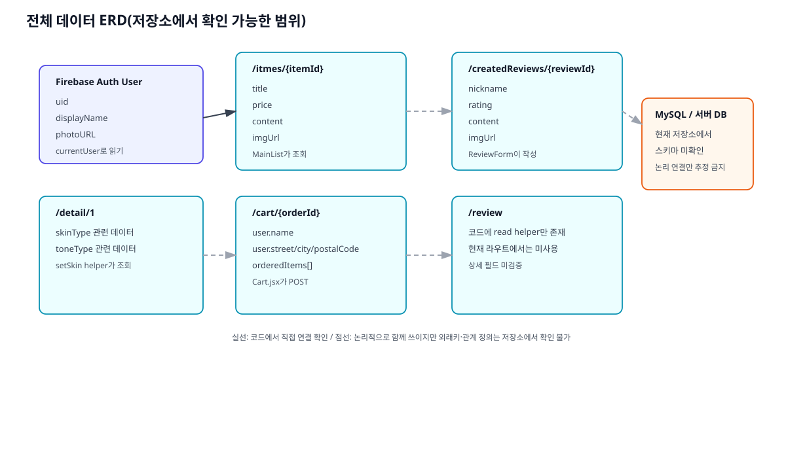

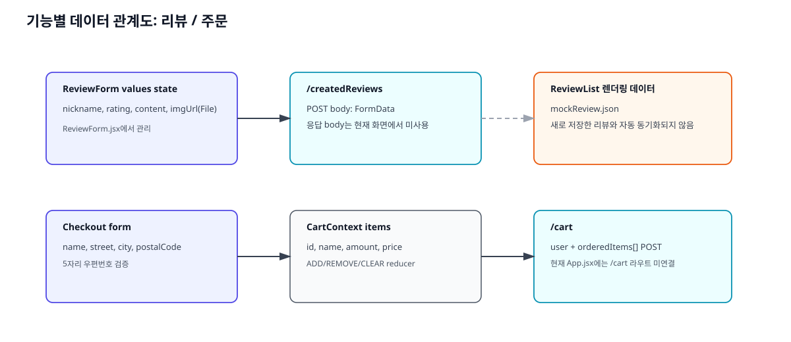

### 상세 스키마

| 노드 | 필드 | 타입(추정) | 필수 여부 | 기본값/제약 | 사용 화면 |
|---|---|---|---|---|---|
| `/itmes/{itemId}` | `title` | string | 메인 렌더링상 사실상 필수 | 없음 | `/main` |
| `/itmes/{itemId}` | `price` | string 또는 number | 사실상 필수 | 없음 | `/main` |
| `/itmes/{itemId}` | `content` | string | 사실상 필수 | 없음 | `/main` |
| `/itmes/{itemId}` | `imgUrl` | string(URL) | 사실상 필수 | 없음 | `/main` |
| `/createdReviews/{reviewId}` | `nickname` | string | 작성 시 필수로 기대 | 폼 초기값은 빈 문자열 | `/review` |
| `/createdReviews/{reviewId}` | `rating` | number 또는 string | 작성 시 필수로 기대 | 초기값 `0` | `/review` |
| `/createdReviews/{reviewId}` | `content` | string | 작성 시 필수로 기대 | 초기값 빈 문자열 | `/review` |
| `/createdReviews/{reviewId}` | `imgUrl` | File/문자열 경로 미확정 | 선택 | 초기값 `null` | `/review` |
| `/cart/{orderId}` | `user.name` | string | 주문 제출 시 필수 검증 | 공백 불가 | 장바구니 흐름 |
| `/cart/{orderId}` | `user.street` | string | 주문 제출 시 필수 검증 | 공백 불가 | 장바구니 흐름 |
| `/cart/{orderId}` | `user.city` | string | 주문 제출 시 필수 검증 | 공백 불가 | 장바구니 흐름 |
| `/cart/{orderId}` | `user.postalCode` | string | 주문 제출 시 필수 검증 | 길이 5 | 장바구니 흐름 |
| `/cart/{orderId}` | `orderedItems[]` | array<object> | 주문 시 필수 | 아이템 구조는 context 기준 | 장바구니 흐름 |
| `/detail/1` | 미상(`skinType`, `toneType` 관련) | object | 미상 | helper만 존재 | 현재 활성 화면 미연결 |
| `/review` | 미상 | object/array | 미상 | helper만 존재 | 현재 활성 화면 미연결 |

### 관계 해석 기준

- **실선 관계**: 프런트 코드에서 직접 요청/응답 또는 저장이 확인된 연결  
- **논리 연결**: 화면 흐름상 함께 쓰이지만 외래키나 스키마 정의는 저장소에서 확인되지 않은 연결  
- **미포함 관계**: README나 이미지 자산에만 존재하고 코드/스키마 원본이 없는 MySQL 관계

## 유지보수 및 운영 절차

### 1) 환경 설정

| 항목 | 실제 위치 | 설명 |
|---|---|---|
| 프런트엔드 루트 | `/home/runner/work/MIMO/MIMO/mimo-frontend` | Create React App 기반 프로젝트입니다. |
| 패키지 정의 | `mimo-frontend/package.json` | `react`, `react-router-dom`, `firebase`, `axios`, `react-webcam` 등을 사용합니다. |
| 환경 변수 예시 | `mimo-frontend/.env` | Firebase 관련 값이 들어 있지만 현재 형식은 일반 CRA `.env` 형식과 다르게 괄호가 포함되어 있습니다. |
| Firebase 초기화 | `mimo-frontend/src/fbase.js` | 코드 안에 Firebase 설정이 하드코딩되어 있습니다. |
| 로그인 상태 저장 | 브라우저 `localStorage['token']` | 보호 라우트 조건에 사용됩니다. |

### 2) 로컬 실행

| 실행 위치 | 명령 | 필요한 설정 | 성공 확인 방법 | 이번 분석에서 확인한 결과 |
|---|---|---|---|---|
| `mimo-frontend` | `npm install` | Node/npm | `node_modules` 생성 | 실행 완료 |
| `mimo-frontend` | `npm start` | 3000 포트 사용 가능 | `http://localhost:3000` 개발 서버 열림 | 실행 완료, 컴파일은 성공했지만 eslint/a11y 경고 다수 확인 |
| `mimo-frontend` | `npm run build` | 동일 | `build/` 폴더 생성 | 절차만 정리, 이번 문서 작성 중에는 미실행 |
| `mimo-frontend` | `npm test` | 인터랙티브 watch 환경 | 테스트 러너 시작 | 절차만 정리, 저장소에 의미 있는 앱 테스트는 거의 없음 |

### 3) 변경 위치 찾기

| 변경하려는 기능 | 먼저 볼 파일 | 함께 따라갈 파일 |
|---|---|---|
| 로그인/회원가입 | `components/Auth/AuthForm.jsx` | `store/auth-context.jsx`, `fbase.js`, `App.jsx` |
| 메인 상품 목록 | `components/Main/MainList.jsx` | `pages/Mainpages.jsx`, Firebase `/itmes.json` 데이터 |
| 카메라/메이크업 | `components/Modeling/camera.js` | `components/Modeling/upload.js`, `components/Modeling/constants.jsx`, 로컬 AI 서버 |
| 프로필/비밀번호 변경 | `components/Profile/UserProfile.jsx` | `components/Profile/ProfileContent.jsx`, `components/Profile/ProfileForm.jsx` |
| 리뷰 | `components/Review/ReviewForm.jsx` | `components/Review/FileInput.jsx`, `components/Review/ReviewList.jsx`, `data/api.jsx` |
| 하단 이동 경로 | `components/Layout/nav/FooterNav.jsx` | `App.jsx` 라우트 정의 |

### 4) 변경 영향 포인트

- 인증 토큰 저장 방식을 바꾸면 `App.jsx`의 보호 라우트 전체가 영향받습니다.  
- Firebase DB 경로명을 바꾸면 `MainList`, `ReviewForm`, `Cart`가 모두 수정 대상입니다.  
- `/cart` 라우트를 복구하려면 `App.jsx`, `MainNavigation.jsx`, `FooterNav.jsx`, Cart 관련 provider 연결 여부를 함께 봐야 합니다.  
- 시뮬레이션 서버 계약을 바꾸면 `camera.js`와 `upload.js`의 요청 필드와 OpenCV 후처리를 같이 조정해야 합니다.

### 5) 테스트·빌드

- **즉시 확인이 필요한 변경**: 화면 라우팅, 인증, Firebase 요청, 카메라 브라우저 권한.  
- **기존 도구**: CRA 기본 `npm start`, `npm run build`, `npm test`.  
- **수동 확인 우선 기능**: 로그인 성공 후 보호 라우트 노출, 상품 목록 로딩, 리뷰 저장 요청, 카메라 권한 승인 후 촬영/업로드.  
- **실행 결과와 절차 구분**: 이번 분석에서는 `npm start`로 앱을 실제 실행해 홈/인증/메인 화면을 캡처했고, 나머지 로그인 필요 화면은 저장소에 포함된 기존 스크린샷을 사용했습니다.

### 6) 배포·복구

현재 저장소에는 Dockerfile, CI/CD workflow, 배포 스크립트, 인프라 설정 파일이 없습니다. 따라서 현재 확인 가능한 범위에서 말할 수 있는 복구 절차는 **프런트 개발 서버 재실행 및 외부 의존성 점검**까지입니다.

- 프런트 화면이 뜨지 않으면 `mimo-frontend`에서 `npm install` 후 `npm start`를 다시 실행합니다.  
- 로그인/DB 연동이 실패하면 Firebase 설정값과 네트워크 접근 가능 여부를 먼저 확인합니다.  
- 카메라 시뮬레이션이 실패하면 `localhost:8000` 서버 기동 여부를 확인합니다. 이 저장소만으로는 해당 서버를 복구할 수 없습니다.

### 7) 증상별 문제 진단 가이드

| 증상 | 먼저 볼 지점 | 확인 내용 |
|---|---|---|
| 로그인 후 보호 화면이 안 열림 | `store/auth-context.jsx`, `App.jsx` | `localStorage['token']` 저장 여부, `isLoggedIn` 계산 여부 |
| 로그인 팝업은 떴지만 이동이 없음 | `AuthForm.jsx` | Google 로그인 성공 후 `navigate()`를 호출하지 않는 현재 흐름 확인 |
| 장바구니 아이콘을 눌러도 화면이 안 바뀜 | `App.jsx` | `/cart` 라우트 부재로 와일드카드가 `/main`으로 돌리는지 확인 |
| 메인 상품이 비어 있음 | `MainList.jsx` | `/itmes.json` 응답 구조와 `response.ok` 확인 |
| 리뷰를 저장했는데 목록이 안 바뀜 | `Review.jsx`, `ReviewForm.jsx` | 목록이 `mockReview.json` 기반이라 서버 응답과 연결되지 않은 구조 확인 |
| 카메라 촬영 후 적용이 안 됨 | `camera.js`, `upload.js` | `localhost:8000` 서버 상태, `path` 전달, `prediction/imageArray` 존재, `this.setState` 사용 여부 |
| 프로필 사진/이름이 비어 있음 | `UserProfile.jsx`, Firebase Auth | `currentUser` 정보가 실제로 채워지는 로그인 방식인지 확인 |

## 검수 결과

- Markdown 본문에서 사용하는 모든 이미지 경로를 `docs/handover/images/` 상대 경로로 맞췄습니다.  
- 내부 링크는 명시적 anchor id(`#architecture`, `#screen-auth` 등)로 연결했습니다.  
- PDF는 같은 Markdown을 HTML로 렌더링한 뒤 생성하는 방식으로 만들 예정이며, 페이지 잘림과 이미지 누락 여부를 함께 확인합니다.
