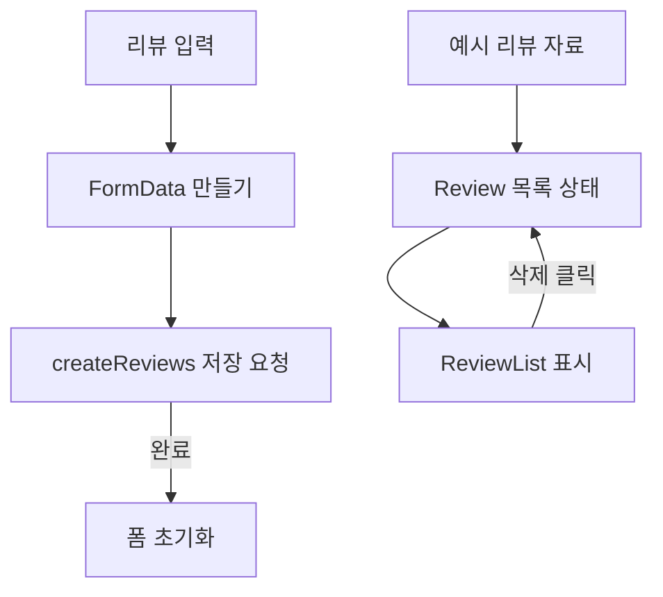

# MIMO — screen-code-handover 업데이트 인수인계

한국시간 2026년 9월 18~19일 업데이트 보고서. 활동 집계 마감은 9월 19일 21:24:15입니다.

화장품 목록·리뷰·카메라 시뮬레이션을 다루는 프런트엔드입니다. 이번에는 인수인계 문서와 화면편집기 연결 예제가 서로 다른 브랜치에 추가됐습니다.

| 항목 | 기준 |
|---|---|
| 보고서 범위 | 이번 기간의 변경과 관련 기능. 전체 시스템 설명은 아래 기존 상세 문서로 연결합니다. |
| 확인 브랜치 | main + update-readme + PR #2 작업 브랜치 |
| 소스 기준 | `1ebd7114c480` / main `fedf905d07bd` |
| 검증 범위 | 두 브랜치의 커밋과 PR 대상, 리뷰 폼·목록·API 코드를 정적으로 대조했습니다. |
| 보고서 세트 | [쉬운 설명](easy-guide.md) · [수정·검증 지시](fix-guide.md) · [코드 인수인계](screen-code-handover.md) |

## 이번 변경의 경계

- 9월 19일 11:14, PR #3의 인수인계 문서가 update-readme에 병합됐습니다.
- 9월 19일 20:54, PR #4의 쉬운 가이드·개발 가이드·상품 카드 manifest가 main에 병합됐습니다.
- 9월 18일 PR #2는 README 참조 오류 수정을 별도 작업 브랜치에 병합했습니다. 이를 main 반영으로 집계하지 않습니다.

update-readme의 기존 보고서에 수록된 리뷰 화면 이미지입니다. 이번 작업에서 새로 실행·캡처한 화면은 아닙니다.

## 핵심 파일과 역할

| 핵심 파일 | 함수·컴포넌트 | 담당 역할 |
|---|---|---|
| [mimo-frontend/src/components/Review/ReviewForm.jsx](https://github.com/feed-mina/MIMO/blob/1ebd7114c480a2917bff4c99e455a3150e2963da/mimo-frontend/src/components/Review/ReviewForm.jsx) | ReviewForm / handleSubmit | 닉네임·별점·본문·이미지로 FormData를 만들고 저장 함수를 호출합니다. 저장 후 입력값을 초기화합니다. |
| [mimo-frontend/src/components/Review/Review.jsx](https://github.com/feed-mina/MIMO/blob/1ebd7114c480a2917bff4c99e455a3150e2963da/mimo-frontend/src/components/Review/Review.jsx) | Review | 리뷰 목록 상태와 삭제 처리를 관리합니다. 목록의 초기 자료 출처를 확인할 위치입니다. |
| [mimo-frontend/src/data/api.jsx](https://github.com/feed-mina/MIMO/blob/1ebd7114c480a2917bff4c99e455a3150e2963da/mimo-frontend/src/data/api.jsx) | createReviews | 리뷰를 외부 데이터 창구에 전송합니다. 본문 형식과 헤더를 함께 확인해야 합니다. |

## 입력·처리·반환과 부수 효과

| 담당 기능 | 입력 | 처리와 분기 | 반환·출력 | 별도로 일어나는 변경 |
|---|---|---|---|---|
| handleSubmit | 폼 이벤트와 values | 기본 제출 중단, FormData 구성, createReviews 호출 | 비동기 반환값 없음 | 외부 저장 요청 후 입력 초기화 |
| Review | mockReview 예시 목록 | 화면 상태로 목록 유지, 삭제 시 배열 갱신 | React 화면 요소 | 로컬 목록 변경 |
| ReviewList | reviews, onDelete | 리뷰별 항목을 렌더링 | React 목록 요소 | 삭제 버튼에서 onDelete 호출 |

## 동작 흐름

현재 폼 저장 결과에서 목록 상태로 이어지는 갱신 연결이 없습니다. 삭제 동작도 서버 삭제와 같다고 보지 않습니다.

## 데이터와 연결 관계

| 저장·전달 대상 | 주요 값 | 관계와 주의점 |
|---|---|---|
| 폼 | nickname,rating,content,imgUrl | FormData 값입니다. JSON 요청과 혼용하지 않도록 확인합니다. |
| 목록 | mockReview.json | 저장 응답을 다시 읽는 목록과 구분합니다. |
| 외부 저장소 | Firebase 요청 | 외부 운영 스키마·규칙은 이번에 조회하지 않았습니다. 관계를 RDB 외래키처럼 표현하지 않습니다. |

## 유지보수와 확인 순서

| 바꾸거나 확인할 것 | 확인 위치와 기준 |
|---|---|
| 브랜치 | 보고서의 링크와 분석 기준을 고정합니다. main에 없는 파일은 update-readme의 커밋 링크를 사용합니다. |
| 리뷰 저장·표시 | ReviewForm, data/api, Review의 저장 후 갱신을 함께 수정합니다. |
| SDUI 가져오기 | main의 상품 카드 예제는 화면 구성 검증용입니다. 업무 서버·DB 연결은 별도입니다. |

프런트엔드 실행 위치는 mimo-frontend입니다. 기존 상세 문서의 로컬 실행 절차를 따릅니다. 실제 Firebase 쓰기나 카메라 서버 호출 없이 문서·코드만 확인했습니다.

## 검증 결과와 남은 범위

두 브랜치의 커밋과 PR 대상, 리뷰 폼·목록·API 코드를 정적으로 대조했습니다.

리뷰 저장의 실제 네트워크 결과, 외부 서버·DB, 카메라 기능은 이번에 실행하지 않았습니다.

## 기존 상세 문서와 활동 근거

- [update-readme 인수인계](https://github.com/feed-mina/MIMO/blob/1ebd7114c480a2917bff4c99e455a3150e2963da/docs/handover/maintenance-handover.md)
- [main SDUI 연결 안내](https://github.com/feed-mina/MIMO/blob/main/docs/sdui-guides/2026-09-19/README.md)
- [README 오류 수정 PR #2](https://github.com/feed-mina/MIMO/pull/2)

| 한국시간 | 커밋 | 기록된 작업 | 구분 |
|---|---|---|---|
| 09/19 11:14 | [1ebd711](https://github.com/feed-mina/MIMO/commit/1ebd7114c480a2917bff4c99e455a3150e2963da) | Merge pull request #3 from feed-mina/copilot/screen-code-handover | 병합 기록 |
| 09/19 11:08 | [71ff493](https://github.com/feed-mina/MIMO/commit/71ff493ff7eb8959650254503972f050e9148101) | docs: add visual handover draft | 변경 기록 |
| 09/19 20:54 | [fedf905](https://github.com/feed-mina/MIMO/commit/fedf905d07bd16cc1c9ed1e3779d3d21363582d2) | docs: MIMO SDUI 연동 가이드와 샘플 게시 (#4) | main 변경 |
